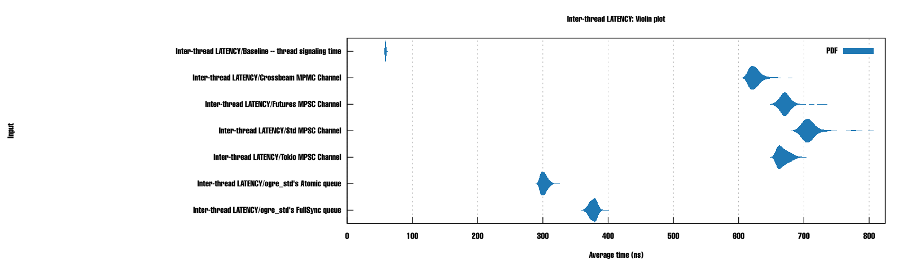

# reactive-mutiny crate

[gh-image]: https://github.com/zertyz/reactive-mutiny/workflows/Rust/badge.svg
[gh-checks]: https://github.com/zertyz/reactive-mutiny/actions/workflows/rust.yml
[cratesio-image]: https://img.shields.io/crates/v/reactive-mutiny.svg
[cratesio]: https://crates.io/crates/reactive-mutiny
[docsrs-image]: https://docs.rs/reactive-mutiny/badge.svg
[docsrs]: https://docs.rs/reactive-mutiny

[![reactive-mutiny GitHub Actions][gh-image]][gh-checks]
[![reactive-mutiny on crates.io][cratesio-image]][cratesio]
[![reactive-mutiny on docs.rs][docsrs-image]][docsrs]

*async Event-Driven Reactive Library for Rust with advanced & optimized containers (channels) and Stream executors*

Browse the [Docs][docsrs].

Rust's `reactive-mutiny` was designed to allow building efficient & elegant asynchronous event processing pipelines (using
Streams -- a.k.a. "async Iterators"), easing flexible & decoupled microservice architectures (distributed or not), ready for production*.

The core of this library is composed of a `Uni` and a `Multi` -- hence the name "Mutiny". Both process streams of events:
  - `Uni` allows **a single listener OR multiple consumers** for each produced payload -- also definable as *allows a single event processing pipeline*;
  - `Multi` allows **multiple listeners AND multiple consumers** for each produced payload, allowing *several event processing pipelines*
    -- or, in Kafka parlance, allows several consumer groups
  - `Multi` may do what `Uni` does, but the former does it faster -- hence, justifying its existence: `Uni` doesn't use any
    reference counting for the payloads and uses a single queue/channel (where `Multi` requires as many as there are listeners).

Moreover, zero-costs metrics & logs are available -- getting optimized away if not used.

Taste the library in this excerpt:

```rust
    use reactive_mutiny::prelude::*;

    fn logic_1(events_stream: impl Stream<Item=InputEventType>) -> impl Stream<Item=OutputEventType> {
        // your logic goes here using Rust's Stream / Iterator functions
    }

    fn main() {
        // build the event processing pipeline
        let events_handle = UniZeroCopy::<InputEventType, 1024, 1>::new()
        .spawn_non_futures_non_fallible_executor("Consumer of InputEventType and issiuer of OutputEventType",
                                                 |events_stream| {
                                                     logic_2(logic_1(events_stream))
                                                         .inspect(|outgoing_event| send(outgoing_event))
                                                 },
                                                 |_executor| async { /* on-close logic */ });

    }

    // see more details in examples/uni-microservice
```

Core components:
  1) A set of channels through which events are sent from producers to consumers -- all context-switch-free (AKA "lock-free") -- including zero-copy & mmap log based ones;
  2) Custom allocators, for superior performance and flexibility;
  3) A set of generic `Stream` executors for all possible combinations of Future/non-Future & Fallible/non-Fallible event types, with the option of enforcing or not a Timeout on each event's resolution of their `Future`. *The API was carefully designed to allow the compiler to fully optimize everything: most of times, all of the reactive code ends up in the executors and the whole Multi / Uni abstractions are zeroed out;*
  4) Instrumentation & Metrics collectors for visibility of the performance and operation;
  5) The main `Multi` and `Uni` objects, along with a set of prelude type aliases binding the channels and allocators together.


**NOTE: This crate is new, but actively used in production: no known bugs exist (and MIRI says we're fine), speed is amazing, API is reasonably stable, but improved docs & code cleanup will still be (slowly) improved, along with any evolutions from community feedback**
**MIRI: Not all parts of this crate are testable with MIRI, as of 2023-06-14: "ready events from epoll_wait is not yet implemented"; "mmap syscalls" and some other functionalities are not available in MIRI -- but what is able to be tested, passes.**


# Performance

This crate was very losely inspired by the SmallRye's Mutiny library for Java, from which some names were borrowed.
Little had to be done to bring the same functionality to Rust, due to the native functional approach, powerful error
handling, async support and wonderful & flexible Iterator/Stream APIs supported by the language, so the focus of this work went into
bringing the events to their maximum processing speed & operability: special queues, topics, stacks, channels and Stream executors have
been created, offering a superior performance over the Rust's native & community versions -- inspect the `benches` folder for details:



*performance characteristics of the standard/community vs our provided raw senders of payloads from one thread to another*


*performance characteristics comparison of standard vs our provided type wrappers and allocators, used for zero-copy channels -- with raw `memcopy` and allocators baselines*

# Where to go next

Docs will still be improved. Meanwhile, the following sequence is suggested for new users of this crate:
  1) Look at the `examples/`;
  2) Inspect the `reactive-socket` crate;
  3) Study the type aliases in `reactive-mutiny::prelude::advanced::*` -- at this point, it is safe to trust the docs will provide everything you'll need. 

# Comparisons

If you're familiar with SmallRye's Mutiny, here are some key differences:
  - Both our `Uni` and `Multi` here process streams of events. On the original library, a Uni is like a single
    "async future" and, since we don't need that in Rust, the names were repurposed: the other Multi is our `Uni` (may also work as our `Multi` when using "subscriptions")
    and the other Uni you may get by just using any Rust's async calls & handling any `Result<>`, for error treatment;
  - Each event fed into the pipeline will be executed, regardless if there is an answer at the end; also, there is no "subscription"
    (subscription is achieved by adding pipelines to a `Multi`);
  - Executors & their settings are set when the pair producer/pipeline comes to be (when the `Uni` / `Multi` object is created): there
    is no .merge() nor .executeAt() to call in the pipeline;
  - No Multi/Uni pipeline conversion and the corresponding plethora of functions -- they are simply not needed;
  - No Uni retries, as it just doesn't make sense to restrict retries to a particular type. See more at the end of this README;
  - No timeouts are set in the pipeline -- they are a matter for the executor, which will simply cancel events (that are `Future`s) that take longer than the configured executor's maximum
    (SmallRye's Uni timeouts are attainable using Tokio's "futures" timeouts, just like one would do for any async function call);
  - Incredibly faster: Rust's compiler makes your pipelines (and most of this library) behave as a zero-cost abstraction (when compiled in Release mode). Const generics play a great
    role for such optimizations -- but this requires some complex types.
  - To fully get the original Mutiny's behavior, you'll have to use:
    - Rust's `reactive-mutiny` (for reactive async event-processing);
    - `Tokio` (to get responses from Futures and to specify timeouts in async calls, async sleeps... saving a ton of APIs for this crate);
    - Streams (the original Mutiny kind of mixes Multi & Stream & Iterator functionalities -- which, in practice, leads to inefficient abuses of
      the original Java library's abstractions -- for using a new instance of their Multi where a Stream or Iterator could be used is a common bad parctice / anti-pattern);
    - A general retry mechanism to simulate what SmallRye's Uni have -- but for all `Result<>` types rathar than just for a particular type --
      see it in action in `examples/error-handing-and-retrying` and observe the meaningful & contextful error messages.
